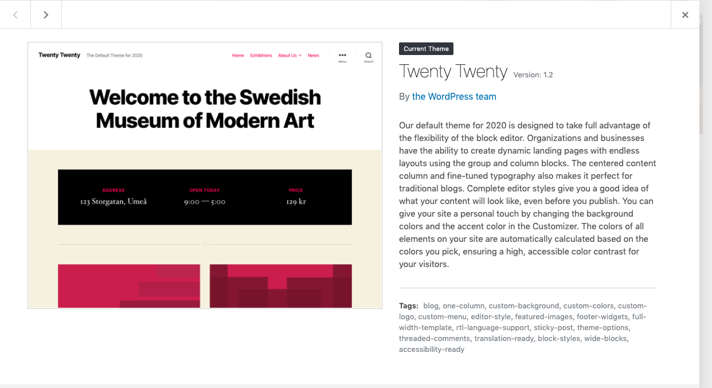

<small>[Back To README](https://github.com/maubanel/bnb) </small>

# Development

## Front End Developer

We used HTML and CSS to construct the website using WordPress. We used the theme "Twenty Twenty" shown below. The theme was the closest to our XD design. 

<kbd>
   
 </kbd>

## Working Functional Code

Below is a screenshot of the Additional CSS Code that was added to the website. We added some CSS to remove the white space, add new font, add new font color, add our logo, add pictures and appointment layout form.

Here is a draft of what the site would look like with the implemented designs. We added some of the major features and it was a pleasure learning how to properly code with HTML and CSS. As a designer it's often easy to design something extravagant, but we learned what is like to be a develeoper and design more practcially.

https://wp.marcaubanel.com

<kbd>
   
 </kbd>
