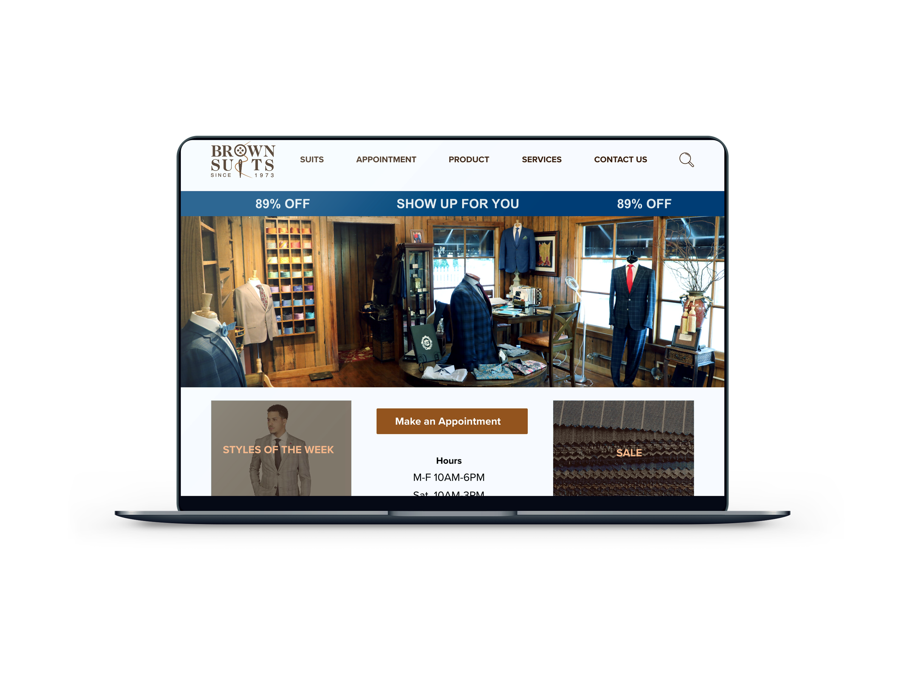

# Executive Summary

Roderick Wilkins
Narges Tavakoli

Spring 2020 UX Project
Brown Suits Business

## Initial Contact 
Tuesday November 12th, 2019

We reached out Brown Suits and asked if he was interested in allowing us to do a real-life UX project on this business. 

## PreScreen 
Tuesday November 26th, 2019 

Brown Suits is local business in the Baton Rouge area and has been serving the community since 1973. Custom clothing reflects class, status and good taste. Brown Suits specializes in meeting the needs of its clients. Whether you visit our showroom location or make a private appointment at your home or office, your shopping experience will represent the utmost in style and luxury. 

## Industry Research

[Industry Research](https://github.com/maubanel/bnb/blob/master/IndustryResearch.md)

## Information Architecture

[Information Architecture](https://github.com/maubanel/bnb/blob/master/InformationArchitecture.md)

## User Research

[User Research](https://github.com/maubanel/bnb/blob/master/UserResearch.md)

## Visual Design

[Visual Design](https://github.com/maubanel/bnb/blob/master/VisualDesign.md)

## Development
[Development](https://github.com/maubanel/bnb/blob/master/Development.md)
