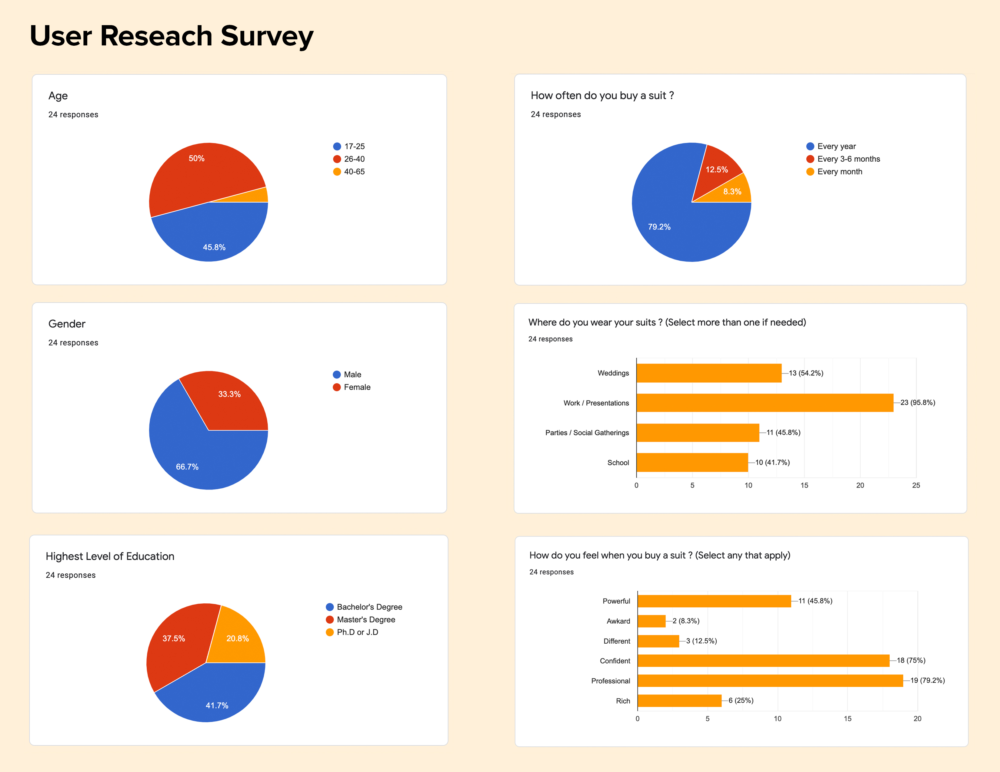
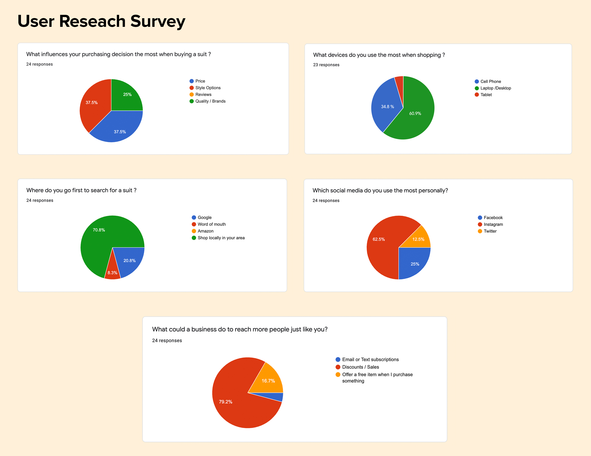
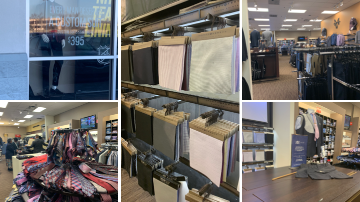
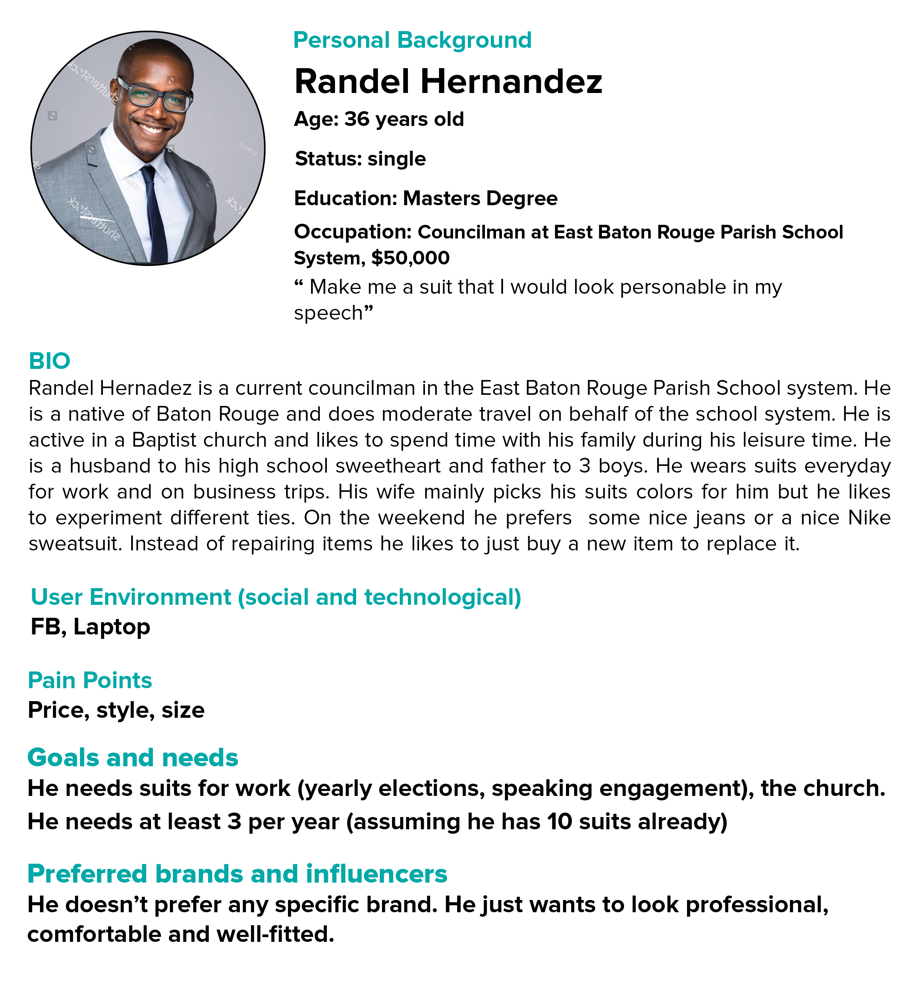
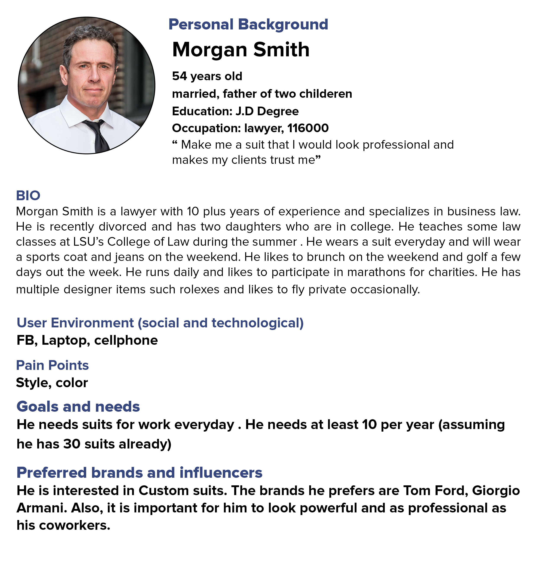
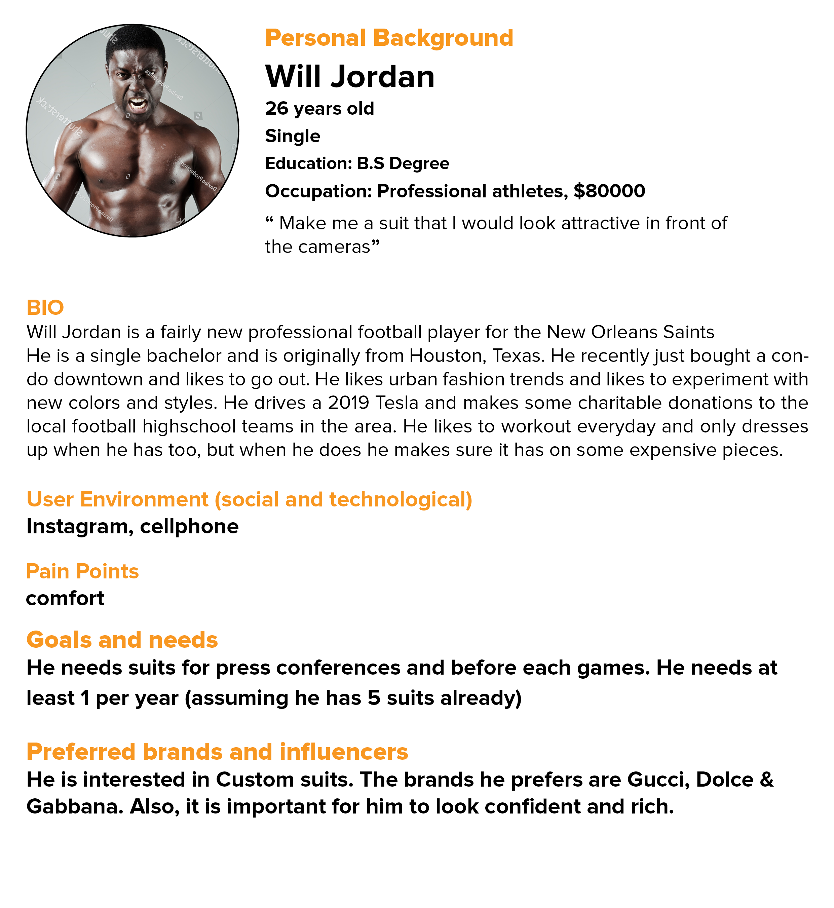
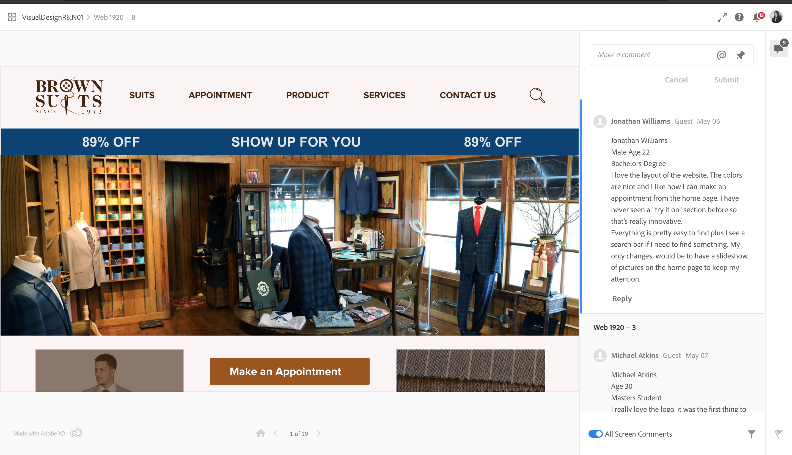

<small>[Back To README](https://github.com/maubanel/bnb) </small>

# User Research

## User Champion
The User Champions of this project are ourselves (Roderick and Narges) because we are keeping the end-user in mind the entire time and not just the re-design. We want to make sure the website experience overall turns into the end user coming to the in-store location. We are constantly evaluating styles and tactics to pull those customers in such as offering more imformation with pictures than words.

## User Interviews
Questions 

* Age ?
* Gender ?
* Highest Level of Education ?
* How often do you buy a suit ?
* Where do you wear your suits ? (Select more than one if needed)
* How do you feel when you buy a suit ? (Select any that apply)
* Occupation (Ex Student , Cashier, Athlete, Consultant)
* What influences your purchasing decision the most when buying a suit ?
* Where do you go first to search for a suit ?
* What devices do you use the most when shopping ?
* Which social media do you use the most personally? 
* What could a business do to reach more people just like you?

Results
 <kbd>
   
 </kbd>
 
 <kbd>
   
 </kbd>

## Research Market Data
 <kbd>
   
 </kbd>

Men's Warehouse is a chain suit shop and we visited a local one in Baton Rouge. We noticed they have pricing info on custom suits immendientaly on the window, which we really liked it. We also noticed that in their custom area they allow you to touch and experiment with different cloths, which is extremely helpful. You can even apply those cloths to a model which is pictured above and this is great for visulaizing your entire suit. Lastly, the store was organized into four main areas: business suits seperated by brand, wedding suits/tuxdeos, accessories and custom suits.

## Gather Findings

We are looking to explore how to get more on foot traffic to enter the store. As of now most customers are by word of mouth and personal relationships. Our research data shows most people want to shop locally in their area for suits, which work perfectly for what we are trying to achieve. Also, per our user research data we see more people would be interested in spending more money if there is a discount or sale involved. Therefore, we will explore more ways to attract new customers by offering some deals such a free cleaning or suit repair for first-time customers. 

## User Personas

Pre Assumptions of what users we think would be in the market for custom suits. 

  <kbd>
   
 </kbd>
   <kbd>
   
 </kbd>
   <kbd>
   
 </kbd>
 
## Design Studies

## Usability Testing

Seven main user journey's are: 
1. Setting an appointment. (easy to find? where do you expect to see it?)
2. Find more information about our custom suit process and price (Do you wanna see a preview of the suit on you? what fabric you would like for the suit)
3. Ordering a pair of shoe
4. Find out about location and store hours
5. Find out more about return policies
6. Find out the reviews on social media 
## Usability Test 01
  
<kbd>
   
 </kbd>
 
### Feedback Summary / AB Testing
Above we have our questions we wanted to ask each tester. We have a website and mobile friendly version because we know some users will first encounter our site on a cell phone. We tested between 12-15 people for our usability prototype test.  Majority of our testers found our prototype to be very usable and easy to navigate. For example, when we asked testers to “go home” and they would click our Logo to go home. They explained most sites have this feature and they're pleased we incorporated it as well. They also loved how descriptive we were and the amount of effort put into the prototype.
 
 Some of the issues that our testers found are when we asked them to go to order a shoe they went to products instead of accessories. We want our site to be as clear as possible and cut the number of frustration clicks. Therefore, one solution we plan to implement is a search bar at the top and changing products to suits therefore we can keep the focus,which is on custom suits.
 
 Another comment was instead of placing our reviews on the main home page to put comments under each product , so the reviews can seem more honest and legit. Also, to add more accessories to our website such cufflinks, suspenders, tie clips and pocket squares. We both agreed these are two ideas we think will help our site in a positive way. 

In addition, some comments were made about placing our social media links in our header as well and not just in the footer at the bottom. Also, placing the store hours in appointment so a potential new customer does not schedule a time and no one is at the shop. 

Overall, these usability tests really help us see our own bias to the design and get a good glimpse of what a real customer thinks and how they would navigate the site.

Here below is the version we tested (Pre) and now a revised verison per testers feedback(Post).

https://github.com/maubanel/bnb/blob/master/Post%20Testing%20Custom%20Clothiers%20Prototype.xd
https://github.com/maubanel/bnb/blob/master/Post%20Testing%20Custom%20Clothiers%20Prototype.xd

## Usability Test 02 (Design completed)

Here is the shareable link to the BrownSuits final web design (interactive) prototype. This link has been shared with different users in order to receive their comments on the user experience and interface of the website.

https://xd.adobe.com/view/a27210a0-d0d7-4f7b-6711-9095a1daec6e-d443/

 <kbd>
   
 </kbd>
 
You can read more comments by clicking on the link above.

