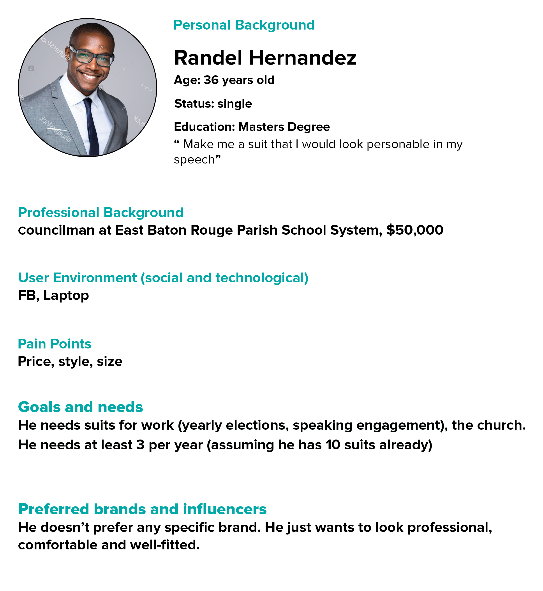

# User Research

## User Champion

## User Interviews

#### Questions we propose 
* Age ?
* Gender ?
* Highest Level of Education ?
* How often do you buy a suit ?
* Where do you wear your suits ? (Select more than one if needed)
* How do you feel when you buy a suit ? (Select any that apply)
* Occupation (Ex Student , Cashier, Athlete, Consultant)
* What influences your purchasing decision the most when buying a suit ?
* Where do you go first to search for a suit ?
* What devices do you use the most when shopping ?
* Which social media do you use the most personally? 
* What could a business do to reach more people just like you?

## Research Market Data

## Gather Findings

#### User Personas

Pre Assumptions of what users we think would be in the market for custom suits. 
<kbd>
  
</kbd>

## Design Studies

## Usability Testing

## A/B Testing
