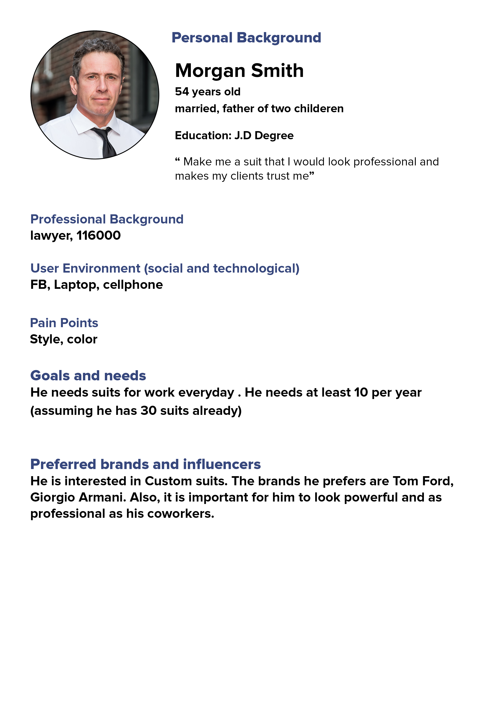
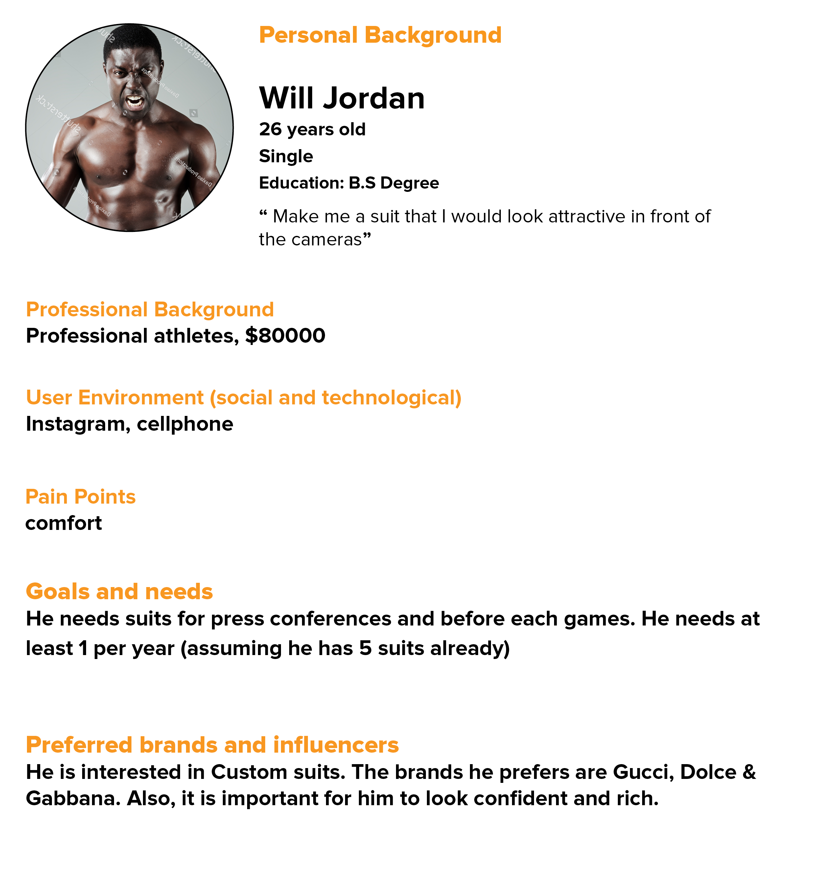

# User Research

## User Champion
The User Champions of this project are ourselves (Roderick and Narges) because we are keeping the end-user in the mind the entire time and not just the client. We want to make sure the website experience overall turns into the end user coming to the in-store location.

## User Interviews
Questions 

* Age ?
* Gender ?
* Highest Level of Education ?
* How often do you buy a suit ?
* Where do you wear your suits ? (Select more than one if needed)
* How do you feel when you buy a suit ? (Select any that apply)
* Occupation (Ex Student , Cashier, Athlete, Consultant)
* What influences your purchasing decision the most when buying a suit ?
* Where do you go first to search for a suit ?
* What devices do you use the most when shopping ?
* Which social media do you use the most personally? 
* What could a business do to reach more people just like you?

## Research Market Data

Men's Warehouse is a chain suit shop and we visited a local one in Baton Rouge. We noticed they have pricing info on custom suits immendientaly on the window, which we really liked it. We also noticed that in their custom area they allow you to touch and experiment with different clothes, which is extremely helpful. You can even apply those clothes to a model which is pictured below and this is great for visulaizing your entire suit.

## Gather Findings

We are looking to explore how to get more on foot traffic to enter the store. As of now most customers are by word of mouth and personal relationships. Also, per our user research data we see more people would be interested in spending more money if there is a discount or sale involved. Therefore, we will explore more ways to attract new customers by offer some deals such a free cleaning or suit repair for first-time customers.

## User Personas

Pre Assumptions of what users we think would be in the market for custom suits. 

  <kbd>
   
 </kbd>
   <kbd>
   
 </kbd>
   <kbd>
   
 </kbd>
 
## Design Studies

## Usability Testing

## A/B Testing
