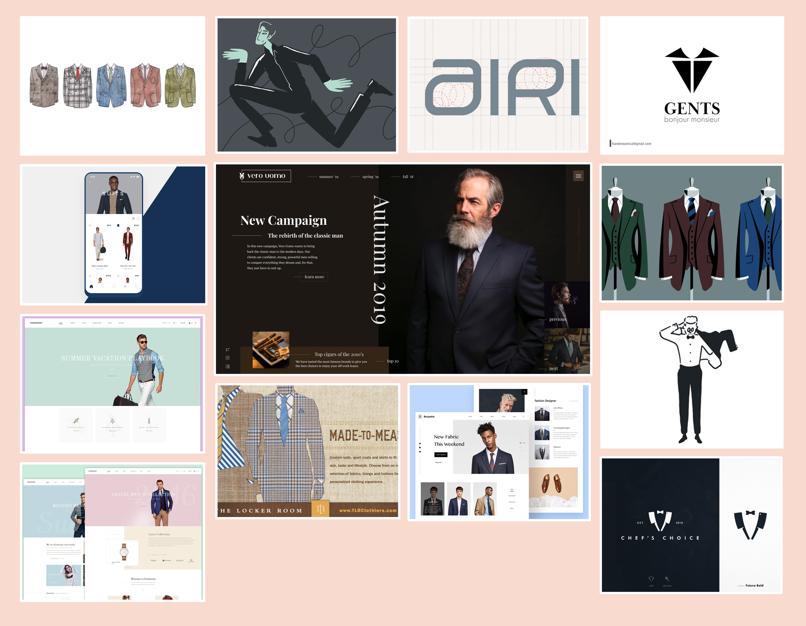
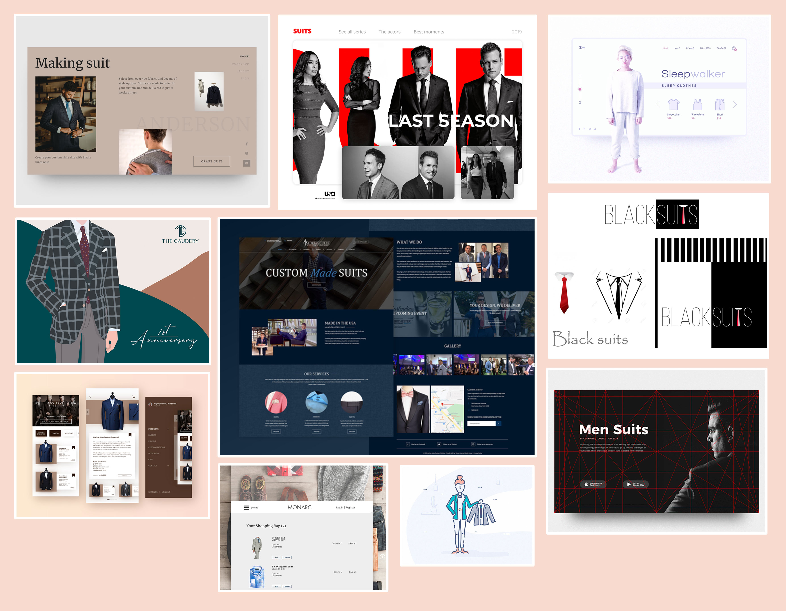
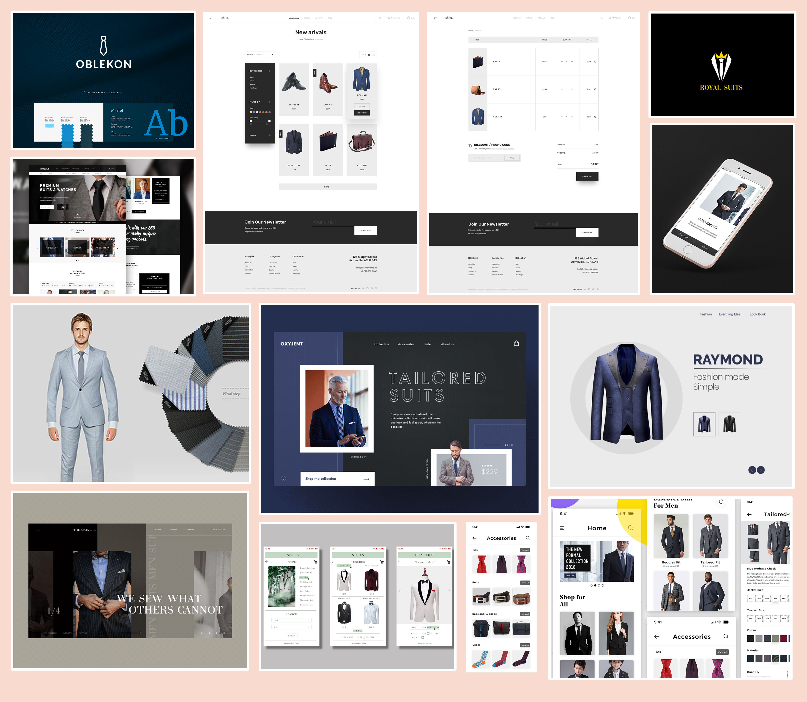
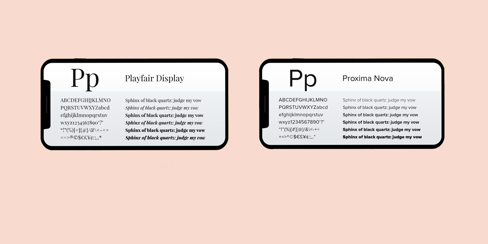
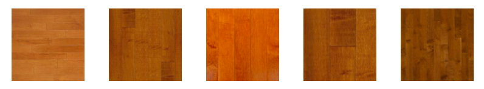
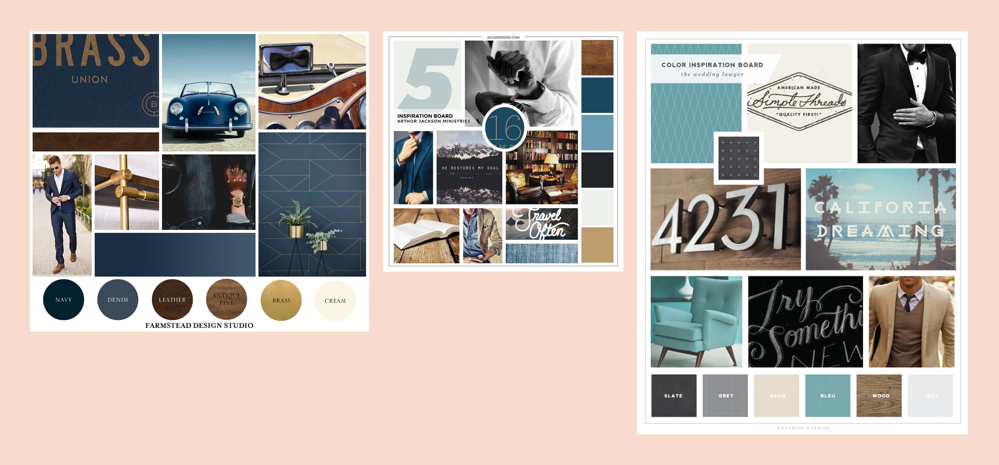
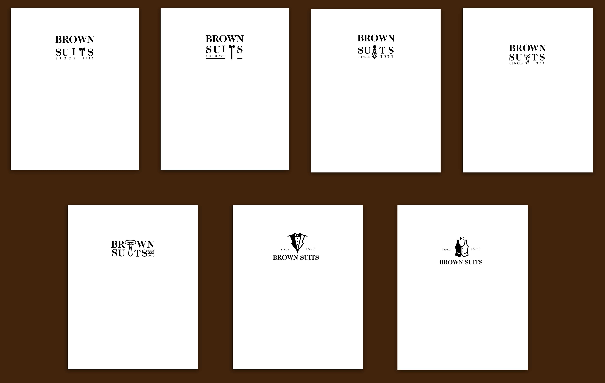
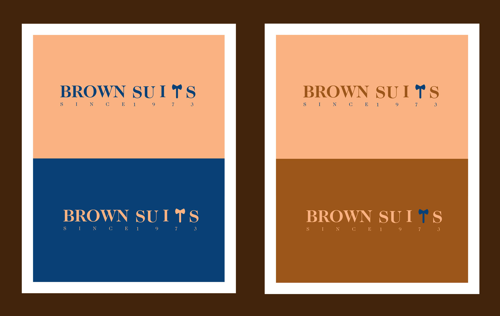
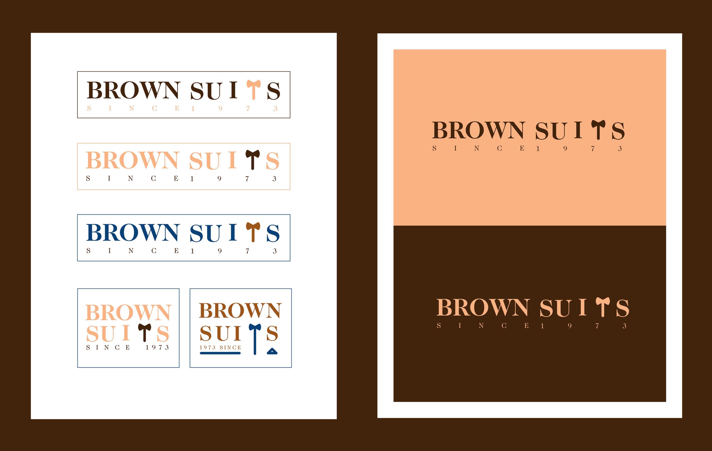
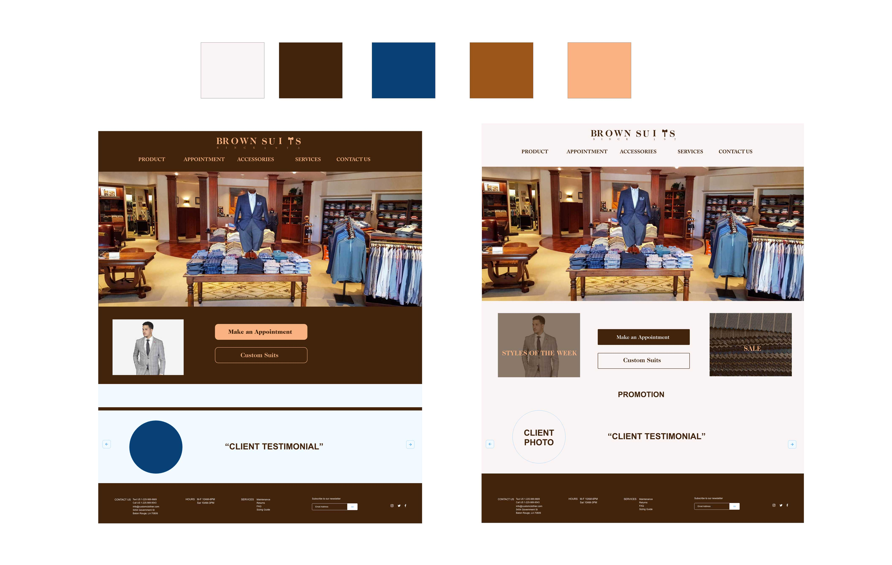

# Visual Design 
## Mood Boards
 <kbd>
   
 </kbd>
 <kbd>
   
 </kbd>
 <kbd>
   
 </kbd>

## Typography
<kbd>
   
 </kbd>
 

## Style
<kbd>
   
 </kbd>
We chose to go with a traditional style to go with the tagline "Since 1973". This traditional aesthetic with show the progression over the years and how much customers appreciate our services.

## Color Swatches
<kbd>
   
 </kbd>
 
 We chose these colors because they provide a since of traditonal and up-scale values. We want our customers to leave with a suit that provides the best version of themselves.

## Logo / Brand
<kbd>
   
 </kbd>
 <kbd>
   
 </kbd>
 <kbd>
   
 </kbd>
 ## Icons
 
## Visual Designer
<kbd>
   
 </kbd>
 

