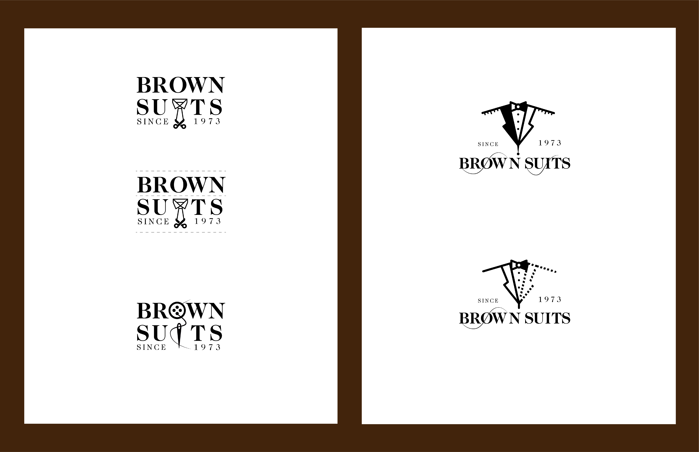
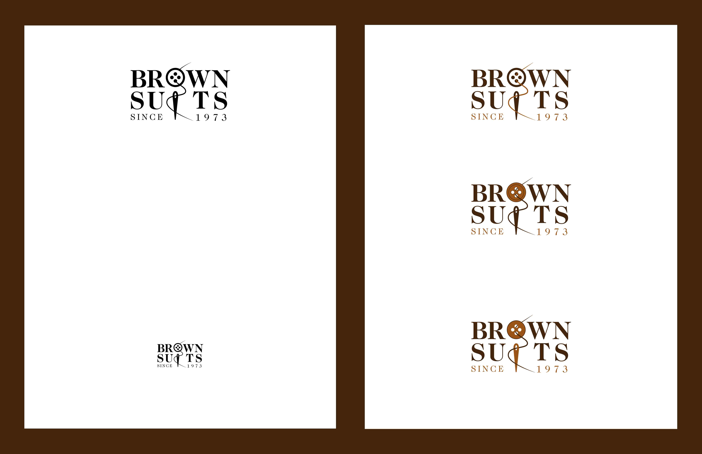
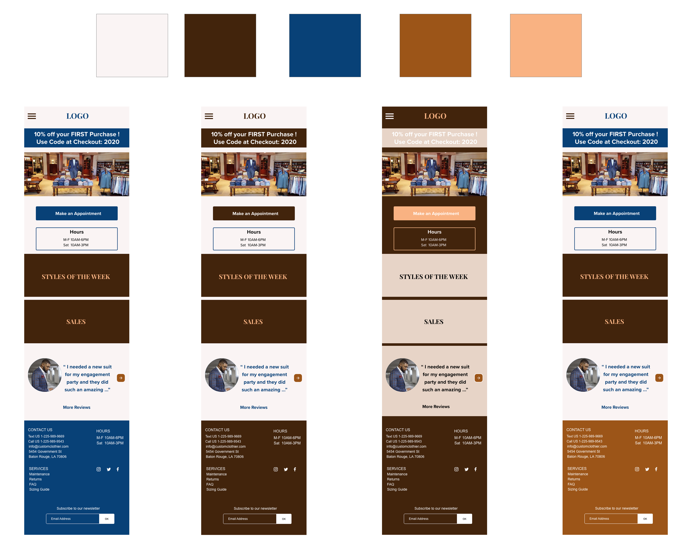

<small>[Back To README](https://github.com/maubanel/bnb) </small>

# Visual Design 

## Mood Boards

We have collected a collage of potential styles and aesthetic for our website. Below we have a range of different types of layout and designs.

<kbd>
   
 </kbd>
 <kbd>
   
 </kbd>
 <kbd>
   
 </kbd>

## Typography

We have decided to use Playfair Display and Proxima Nova as our two main focus fonts. We plan to use Playfair Display for main healines and Proxima Nova on all other text on the website.

<kbd>
   
 </kbd>
 

## Style

We chose to go with a traditional style to go with the tagline "Since 1973". This traditional aesthetic will show the progression over the years and how much customers appreciate our services. Showcasing the wood pictured below is to establish the traditional tones we plan to have throughout the design.

<kbd>
   
 </kbd>

## Color Swatches

We chose these colors because they provide a since of traditon and up-scale values. We want our customers to leave with a suit that provides the best version of themselves. 

<kbd>
   
 </kbd>
 
## Logo / Brand (First Pass)

Here below are our first pass of potential logos for the website. We we're going for a simplistic design which showcases our business's mission and tagline "Since 1973". Also, incorporating some suit accessories like a bow tie or vest to the logo to help make it stand out.

<kbd>
   
 </kbd>
 <kbd>
   
 </kbd>
 <kbd>
   
 </kbd>
 
 ## Logo / Brand (Second Pass)
 
 Here below is our second pass of potential logos for the website. We decided to go back and add more of a custom feel so we   decided to incorporate some designs with a neddle and thread for example. We want our customers to know they are recieveing a unqiue suit for themselves.
 
  <kbd>
   
 </kbd>
 
 And here is the Final Logo
   <kbd>
   
 </kbd>
 
 ## Icons

 
## Visual Designs (First Pass)

Below we have both our web and phone prototype verisons with our color pallet. We created a range to see what looks better and what colors to use for certain headlines, buttons, text and etc. We agreed we prefer a lighter background which causes the brown to stand out. Also we would use the navy blue as our acent color and use it for areas we want to draw attention to such as for promotion tags.

<kbd>
   
 </kbd>
 
<kbd>
   
 </kbd>

## Visual Designs (Second Pass)

Below we have another verison of our web and phone prototypes. We incorporated the light background theme because it was the most effective in our eyes. We tested the theme our 4 main pages (Home, Suits, Appointment and Products).

<kbd>
   
 </kbd>
